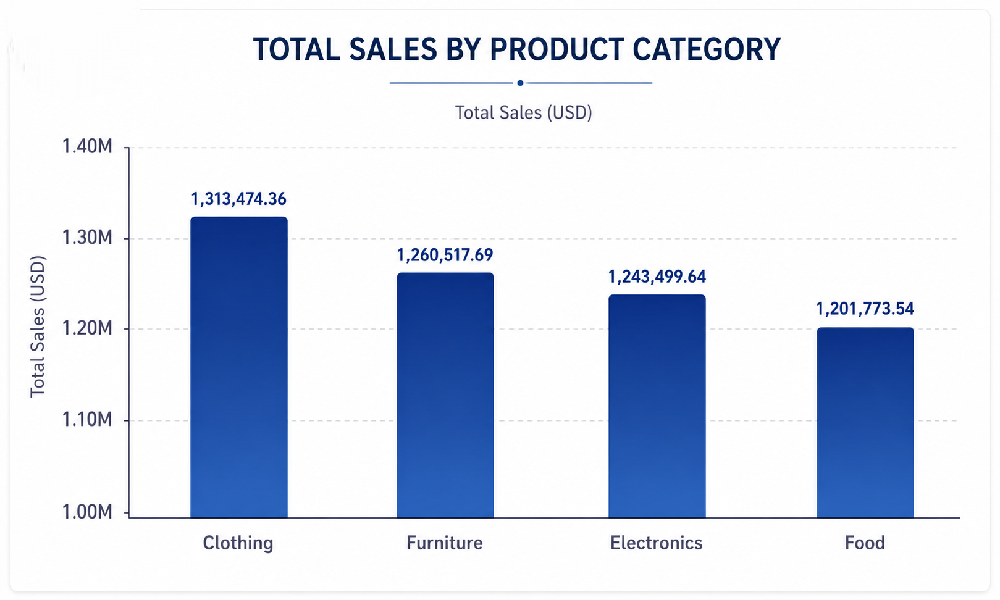
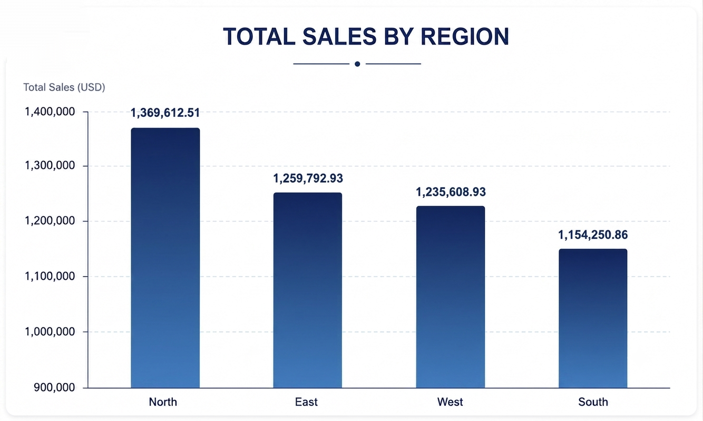
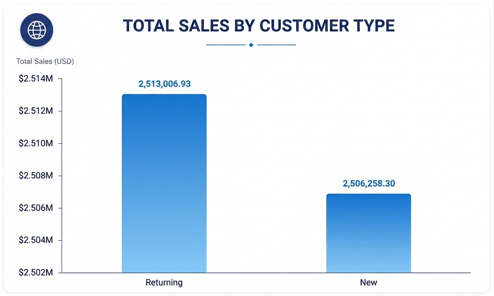
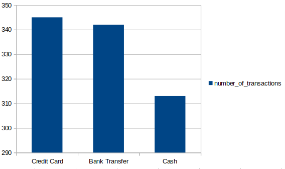
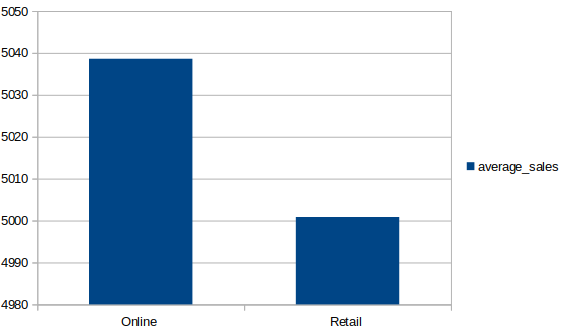
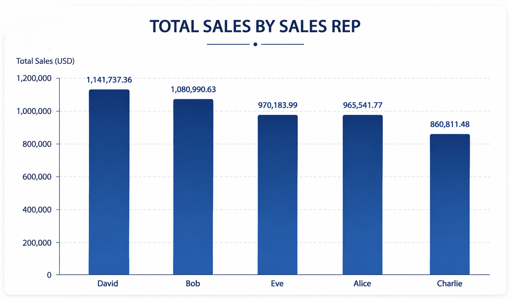
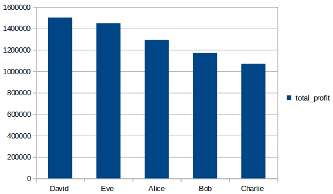

# Retail Sales Analysis using SQL
## 📌 Overview 
This work analyzes a retail sales dataset using SQL to extract meaningful business insights.   
The goal is to understand sales performance across products, regions, customers, and payment methods.  
This work simulates real-world business analysis tasks commonly performed by Data Analysts.

---

## 📂 Dataset Description

The dataset contains sales transaction records with the following columns:

- Product_ID  
- Sale_Date  
- Sales_Rep  
- Region  
- Sales_Amount  
- Quantity_Sold  
- Product_Category  
- Unit_Cost  
- Unit_Price  
- Customer_Type (New / Returning)  
- Discount
- Payment_Method  
- Sales_Channel (Online / Retail)  
- Region_and_Sales_Rep

---

## 🧰 Tools Used

- SQL  
- SQLite  
- Kaggle Dataset  

---

## 📊 Business Questions & SQL Analysis

### 1. Total Sales Revenue
```sql
SELECT SUM(Sales_Amount) AS total_revenue
FROM sales;
```

### 2. Sales by Product Category
```sql
SELECT Product_Category,
       SUM(Sales_Amount) AS total_sales
FROM sales
GROUP BY Product_Category
ORDER BY total_sales DESC;
```

### 3. Sales by Region
```sql
SELECT Region,
       SUM(Sales_Amount) AS total_sales
FROM sales
GROUP BY Region
ORDER BY total_sales DESC;
```

### 4. Sales by Sales Representative
```sql
SELECT Sales_Rep,
       SUM(Sales_Amount) AS total_sales
FROM sales
GROUP BY Sales_Rep
ORDER BY total_sales DESC;
```

### 5. Payment Method Analysis
```sql
SELECT Payment_Method,
       COUNT(*) AS number_of_transactions
FROM sales
GROUP BY Payment_Method
ORDER BY number_of_transactions DESC;
```

### 6. Customer Type Analysis
```sql
SELECT Customer_Type,
       SUM(Sales_Amount) AS total_sales
FROM sales
GROUP BY Customer_Type
ORDER BY total_sales DESC;
```

### 7. Average Sales by Channel
```sql
SELECT Sales_Channel,
       AVG(Sales_Amount) AS average_sales
FROM sales
GROUP BY Sales_Channel;
```

### 8. Profit Analysis
```sql
SELECT Sales_Rep,
       SUM((Unit_Price - Unit_Cost) * Quantity_Sold) AS total_profit
FROM sales
GROUP BY Sales_Rep
ORDER BY total_profit DESC;
```

### 📈 Key Insights

- Clothing is one of the highest revenue-generating product categories.
- The North region shows strong sales performance.
- Credit Card is the most commonly used payment method.
- Some sales representatives significantly outperform others.
- Online sales channels contribute strongly to revenue.
- Profit varies significantly across sales representatives and products.


### 🧠 Skills Demonstrated

- SQL data aggregation (SUM, COUNT, AVG)
GROUP BY analysis
- Business performance reporting
Profit calculation
- Data interpretation and insights generation


### 🎯 Final Note 

This work demonstrates SQL skills applied to real-world sales data analysis. 
It is suitable for portfolio use and entry-level Data Analyst roles. 


### 🚀 Future Improvements 

- Add time-based analysis (monthly trends)
- Add customer segmentation analysis 
- Build dashboards using BI tools.


** Key Metrics **

| Metric | Value |
|--------|------:|
| Total Revenue | **$5.02M** |


### Sales by Product Category



### Sales by Region



### Sales by Customer Type



### Sales by Payment Method



### Average Sales by Channel



### Top Sales Representatives



### Profit by Sales Representative




  
